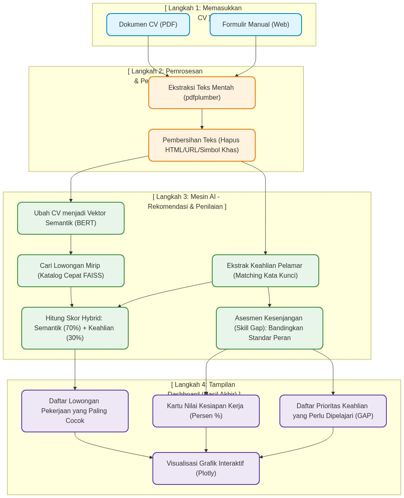
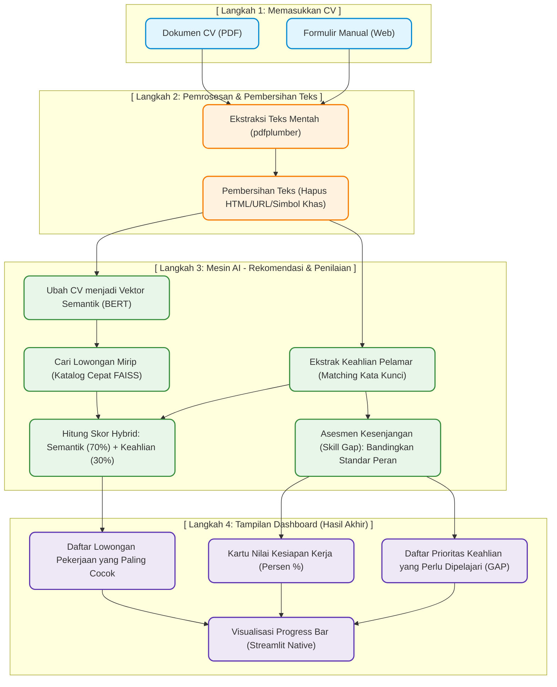

# Panduan Sederhana: Pembangunan Machine Learning & Dashboard Streamlit
**Proyek: CV Intelligence & Job Matcher**  
*Mata Kuliah / Tim Projek: Semester 4 Politeknik Negeri Madiun*

Buku panduan ini ditulis dengan bahasa yang sederhana agar Anda mudah memahami alur kerja aplikasi secara logis, serta dapat menjelaskannya dengan lancar dan meyakinkan di depan Dosen Penguji (bahkan jika dosen Anda tidak memiliki latar belakang teknis yang mendalam).

---

## 1. Alur Sistem Secara Sederhana (Bagaimana Data Mengalir?)

Berikut adalah diagram alur yang menjelaskan bagaimana CV yang Anda masukkan diolah oleh sistem hingga menghasilkan rekomendasi lowongan pekerjaan dan penilaian kesiapan kerja Anda.

<b>Klik di sini untuk melihat Kode Sumber Mermaid (jika ingin diedit kembali)</b>

### Penjelasan Diagram Langkah demi Langkah:
1. **Langkah 1 (Input):** Anda memberikan informasi CV ke aplikasi. Caranya bisa dengan mengunggah file **PDF CV** secara langsung atau mengisi **formulir profil** di web.
2. **Langkah 2 (Membaca & Membersihkan):** Sistem membaca dokumen Anda, membuang bagian yang mengganggu (seperti kode HTML, link internet, email, atau simbol-simbol aneh) agar teks menjadi bersih dan siap diproses.
3. **Langkah 3 (Otak AI Bekerja):**
   * **Mencari Arti (Semantik):** Teks CV diterjemahkan oleh model AI bernama **BERT** menjadi "sidik jari digital" (angka-angka vektor) yang menggambarkan makna CV tersebut.
   * **Mencari Lowongan:** Angka vektor CV tadi dicocokkan dengan ratusan lowongan di database menggunakan pustaka **FAISS** (seperti katalog super cepat).
   * **Mencari Kata Kunci Skill:** Sistem mendeteksi teknologi apa saja yang Anda kuasai.
   * **Menghitung Skor:** Lowongan diurutkan berdasarkan gabungan pemahaman arti lowongan (semantik) dan kecocokan skill nyata Anda.
   * **Analisis Gap:** Skill Anda dibandingkan dengan standar keahlian industri untuk melihat apa saja yang belum Anda kuasai.
4. **Langkah 4 (Tampilan Hasil):** Hasil perhitungan AI ditampilkan dalam bentuk persen kesiapan kerja, daftar pekerjaan teratas yang cocok, dan daftar skill penting yang masih kurang untuk segera dipelajari.

---

## 2. Proses Pembuatan Model AI (`Machine_Learning.ipynb`)

Berikut adalah penjelasan mengenai 6 tahapan yang dilakukan di dalam file Jupyter Notebook (`Machine_Learning.ipynb`) dengan menggunakan analogi sederhana:

### Tahap 1: Persiapan Lingkungan & Pemeriksaan Data (EDA)
* **Tujuan:** Merapikan dan mempelajari dataset lowongan kerja sebelum diolah.
* **Yang Dilakukan:**
  * Memastikan kolom-kolom penting seperti judul lowongan dan syarat keahlian sudah lengkap dan tidak tertukar datanya.
  * Menghitung statistik sederhana: dari portal mana saja lowongan ini berasal, kota apa saja yang paling banyak membuka lowongan, dan kisaran gaji yang ditawarkan.
  * **Analogi:** Seperti koki yang memeriksa bahan masakan di dapur, memastikan semua sayur segar dan membuang bahan yang rusak sebelum mulai memasak.

### Tahap 2: Pembersihan Teks & Ekstraksi Skill
* **Tujuan:** Menyiapkan teks lowongan agar bersih dan mendeteksi skill di dalamnya.
* **Yang Dilakukan:**
  * **Pembersihan Teks:** Menghapus tag kode website dan link agar menyisakan teks deskripsi pekerjaan yang murni.
  * **Taksonomi Skill:** Membuat kamus keahlian teknologi (misal: Python, SQL, React) agar sistem tahu kata kunci apa saja yang termasuk keahlian teknis.
  * **Ekstraksi Skill:** Menggunakan rumus pencocokan kata (Regex) untuk menandai keahlian apa saja yang tertulis di lowongan.
  * **Analogi:** Seperti membaca buku resep dan menandai bahan-bahan penting menggunakan stabilo berwarna cerah agar mudah dibaca nanti.

### Tahap 3: Pembuatan Mesin Rekomendasi Lowongan Kerja
* **Tujuan:** Membuat program yang bisa mencarikan pekerjaan paling cocok untuk pelamar.
* **Yang Dilakukan:**
  * **BERT (all-MiniLM-L6-v2):** Model ini berfungsi seperti penerjemah bahasa yang sangat pintar. Model ini mengubah kalimat deskripsi lowongan menjadi kumpulan angka (vektor) yang mewakili *makna kontekstual*.
  * **FAISS (Katalog Cepat):** Indeks penyimpanan khusus untuk mencari lowongan dengan vektor yang mirip secara instan.
  * **Skor Hybrid (Gabungan):** Agar hasil pencarian akurat, kami menggabungkan kesamaan makna semantik (bobot 70%) dengan kecocokan skill teknis secara langsung (bobot 30%).
  * **Analogi:** Saat Anda mencari buku di perpustakaan, pustakawan tidak hanya mencari buku dengan judul yang mirip, tetapi juga mencarikan buku dengan topik isi (makna) yang sesuai dengan minat Anda.

### Tahap 4: Sistem Penilaian Kesenjangan Keahlian (Skill Gap Assessment)
* **Tujuan:** Mengukur seberapa siap pelamar untuk melamar posisi tertentu dan memberi tahu kekurangan mereka.
* **Yang Dilakukan:**
  * Menyusun standar keahlian untuk 6 posisi (seperti Data Engineer, Frontend, Backend, dll) yang dibagi menjadi: **Core** (skill wajib), **Expected** (standar industri), **Nice to Have** (nilai tambah), dan **Soft Skills** (interpersonal).
  * **Rumus Bobot:** Core diberi bobot nilai terbesar (40%), Expected (30%), Nice to Have (15%), dan Soft Skills (15%).
  * Menghasilkan tingkat kesiapan (Sangat Siap, Cukup Siap, dll.) serta daftar skill prioritas yang harus dipelajari.
  * **Analogi:** Seperti ujian kelayakan kerja di mana mata pelajaran inti (Core) memiliki nilai kelulusan yang lebih tinggi daripada mata pelajaran tambahan.

### Tahap 5 & 6: Penggabungan, Pengujian, dan GCP
* **Tujuan:** Menyatukan seluruh fungsi menjadi satu kesatuan kode (`CVAnalysisPipeline`) dan mempersiapkannya untuk diunggah ke internet (deployment).
* **Yang Dilakukan:**
  * Menguji kecepatan jalannya sistem. Target waktu respon adalah di bawah 2 detik agar pengguna tidak menunggu terlalu lama.
  * Mempersiapkan kode untuk diunggah ke Google Cloud Platform (GCP) agar sistem bisa diakses online secara global.

---

## 3. Cara Memasang dan Menjalankan Model di Streamlit

Ketika model AI dipindahkan dari notebook ke aplikasi dashboard **Streamlit**, kami melakukan optimasi khusus agar aplikasi web menjadi sangat cepat dan stabil:

1. **Mengingat Data Berat (`@st.cache_resource`):**
   * Memuat model AI (BERT) dan database lowongan ke memori server memerlukan waktu yang cukup lama (sekitar 5-10 detik) dan memori RAM yang besar.
   * Dengan decorator `@st.cache_resource`, Streamlit diperintahkan untuk memuat model dan database ini **hanya satu kali saja** saat web pertama kali dinyalakan. Pada kunjungan berikutnya, data langsung diambil dari memori RAM yang aktif.
   * **Analogi:** Seperti guru yang menyalin peta dunia di papan tulis satu kali saja di pagi hari, alih-alih menggambar ulang dari awal setiap kali murid baru masuk kelas.
2. **Membaca File PDF (`pdfplumber`):**
   * Library `pdfplumber` bertugas membaca berkas PDF CV yang diunggah pengguna, memilah teks halaman demi halaman, lalu menyatukannya menjadi satu paragraf teks panjang untuk dianalisis oleh mesin AI.
3. **Visualisasi Menggunakan Progress Bar Native:**
   * Untuk menyederhanakan kode dashboard agar lebih mudah dibaca, cepat dimuat, dan ringan, kami mengganti grafik Plotly yang berat dengan komponen progress bar bawaan Streamlit (`st.progress`). Visualisasi ini menampilkan persentase kesiapan per kategori skill secara minimalis namun tetap premium dan profesional.

---

## 4. Panduan Menjawab Pertanyaan Dosen Penguji

Berikut adalah rangkuman cara menjawab pertanyaan dosen dengan gaya penjelasan sederhana namun berbobot ilmiah:

* **Tanya: Mengapa memakai Semantic Search berbasis BERT, bukan mencari kata kunci biasa?**
  * **Jawab Sederhana:** *"Pencarian kata kunci biasa sangat terbatas. Jika CV menulis 'pembuat program' dan lowongan menulis 'software developer', pencarian kata kunci tidak akan mendeteksi kecocokan karena ejaannya berbeda. Dengan Semantic Search berbasis BERT, sistem memahami makna kontekstual di balik kata-kata tersebut. Sistem tahu bahwa kedua istilah tersebut memiliki arti yang sama, sehingga hasilnya jauh lebih relevan."*

* **Tanya: Apa peran FAISS di dalam aplikasi ini?**
  * **Jawab Sederhana:** *"FAISS bertindak seperti katalog perpustakaan digital yang super cepat. Ketika sistem mengubah CV menjadi kumpulan angka vektor, FAISS akan membandingkan vektor tersebut dengan ratusan lowongan kerja di database secara instan dalam hitungan milidetik, tanpa membuat RAM server menjadi lambat."*

* **Tanya: Mengapa pencarian lowongan menggunakan metode Hybrid?**
  * **Jawab Sederhana:** *"Jika kami hanya memakai pemahaman arti (semantik) BERT, terkadang ada skill teknis wajib yang terlewatkan. Oleh karena itu, kami menggabungkan kesamaan makna semantik (bobot 70%) dengan kecocokan skill nyata yang diminta lowongan (Jaccard Overlap, bobot 30%). Hasil gabungan ini menjamin rekomendasi pekerjaan yang didapatkan tidak hanya mirip secara umum, tetapi juga sesuai dengan skill teknis pelamar."*

* **Tanya: Bagaimana cara menentukan skor kesiapan kerja (Readiness Score)?**
  * **Jawab Sederhana:** *"Kami membandingkan skill pelamar dengan standar kebutuhan industri untuk posisi target. Kami membaginya menjadi 4 tingkat keahlian dengan bobot nilai yang berbeda: keahlian inti (Core) bernilai 40%, keahlian penunjang (Expected) 30%, nilai tambah (Nice to Have) 15%, dan keahlian sosial (Soft Skills) 15%. Gabungan nilai berbobot inilah yang menghasilkan persentase kesiapan kerja pelamar."*
