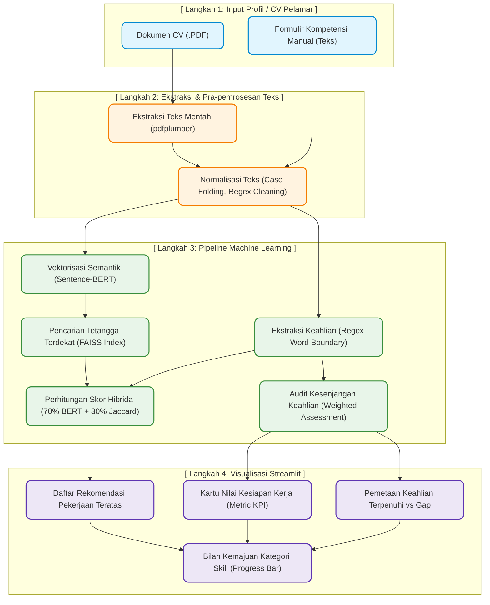

# 📖 Panduan Proses Pengembangan Machine Learning & Dashboard Streamlit
**Proyek: CV Intelligence & Job Matcher**  
*Mata Kuliah / Tim Projek: Semester 4 Politeknik Negeri Madiun (S4 Data Engineering)*

Buku panduan ini dirancang untuk menjelaskan seluruh alur pengembangan, dari eksperimen model di Jupyter Notebook hingga pembuatan backend API dan antarmuka dashboard interaktif menggunakan Streamlit. Panduan ini menggunakan bahasa yang sistematis, runtut, dan mudah dipahami, sehingga dapat digunakan sebagai materi utama untuk presentasi di depan Dosen Penguji.

---

## 1. Arsitektur dan Alur Data Sistem (End-to-End)

Diagram di bawah ini menggambarkan bagaimana data CV pelamar kerja diproses secara bertahap oleh kecerdasan buatan (BERT & FAISS) hingga menghasilkan kecocokan lowongan kerja dan rekomendasi kesiapan keahlian di layar dashboard.

<b>Klik di sini untuk melihat Kode Sumber Mermaid (jika ingin diedit kembali)</b>

### Penjelasan Detail Alur Data:
1. **Langkah 1 (Input):** Pelamar kerja memasukkan profil mereka melalui dua opsi: mengunggah berkas **PDF CV** asli, atau mengisi **formulir teks** terstruktur (Tahun Pengalaman, Pendidikan, Keahlian Pilihan).
2. **Langkah 2 (Ekstraksi & Pembersihan):**
   * Jika pelamar mengunggah PDF, pustaka `pdfplumber` membaca aliran data byte berkas di memori dan mengekstrak teks mentah per halaman.
   * Teks yang didapat dibersihkan dari karakter non-alfanumerik, tautan URL, alamat email, spasi liar, dan diubah menjadi huruf kecil (*case folding*) agar seragam.
3. **Langkah 3 (Logika AI Pipeline):**
   * **Sentence-BERT:** Mengubah string teks CV menjadi vektor 384 dimensi yang merepresentasikan makna kontekstual CV tersebut.
   * **FAISS Indexing:** Mengambil koordinat vektor CV pelamar dan mencocokkannya dengan 108.963 koordinat vektor lowongan kerja di database dengan metode pencarian tetangga terdekat secara instan (milidetik).
   * **Jaccard Skill Matching:** Pustaka Regex mendeteksi keahlian apa saja yang tertulis di CV menggunakan pencarian presisi batas kata (`\b`).
   * **Skor Hybrid:** Menggabungkan skor semantik BERT (bobot 70%) dengan skor Jaccard Overlap keahlian (bobot 30%) untuk meranking ulang lowongan terdekat.
   * **Weighted Assessment:** Membandingkan keahlian pelamar dengan standar kompetensi posisi target industri.
4. **Langkah 4 (Tampilan Akhir):** Informasi hasil kalkulasi AI ditampilkan secara premium di antarmuka web Streamlit.

---

## 2. Struktur Berkas Pengembangan

Untuk membangun sistem ini dari awal, berkas-berkas berikut ini wajib dibuat dan dikonfigurasi:

| Nama Berkas / Direktori | Tipe | Peran dan Penjelasan Fungsi |
| :--- | :--- | :--- |
| **`Machine_Learning.ipynb`** | Jupyter Notebook | Tempat eksperimen pembuatan model AI, eksplorasi data (EDA), ekstraksi fitur, pembuatan indeks FAISS, pengujian formula skor, dan evaluasi performa model. |
| **`streamlit_app.py`** | Python Script | Berkas utama dashboard frontend Streamlit. Berisi kode tata letak antarmuka, penanganan unggahan berkas, pemrosesan formulir, dan rendering visual komponen dashboard. |
| **`app/config.py`** | Python Script | Membaca variabel lingkungan dari berkas `.env` (seperti nama model embedding, direktori penyimpanan, konfigurasi CORS) menggunakan Pydantic Settings. |
| **`app/skill_utils.py`** | Python Script | Menyediakan utilitas manipulasi teks keahlian: memuat berkas taksonomi, standardisasi teks, deteksi kata batas Regex, dan kalkulasi audit kesiapan kerja (Jaccard). |
| **`app/pipeline.py`** | Python Script | Jantung pemrosesan ML. Menggabungkan SentenceTransformer (BERT) dan FAISS Index untuk menyajikan hasil analisis inferensi dalam satu fungsi panggilan (`analyze`). |
| **`app/main.py`** | Python Script | Endpoint backend API menggunakan FastAPI. Menyediakan route `/health`, `/roles`, dan `/analyze/` untuk melayani integrasi client-server. |
| **`models/`** | Direktori | Menyimpan seluruh artefak model ML hasil ekspor notebook (indeks FAISS biner, metadata lowongan CSV, taksonomi skill JSON, dan profil peran JSON). |

---

## 3. Rincian Tahapan Kode di `Machine_Learning.ipynb`

Di dalam Jupyter Notebook, kita membagi proses pengembangan ke dalam 6 bagian besar:

### Tahap 1: Eksplorasi Data Awal (EDA)
* **Perlu Mengoding:** Mengimpor pustaka `pandas`, membaca dataset lowongan kerja mentah, melakukan pembersihan data kosong (`dropna`), mendeteksi sebaran kota, dan menganalisis portal penyedia lowongan kerja.
* **Tujuan:** Memahami karakteristik data iklan lowongan kerja, rentang gaji, dan memastikan kolom deskripsi pekerjaan tidak ada yang kosong.

### Tahap 2: Pembersihan Teks & Ekstraksi Skill
* **Perlu Mengoding:** Membuat kamus taksonomi keahlian (JSON) yang mengelompokkan keahlian ke dalam kategori tertentu. Menulis fungsi pembersih teks berbasis ekspresi reguler (`re.sub` untuk menghapus tag HTML, URL, dan simbol non-alfabet). Menulis fungsi pencari keahlian dengan pembatas kata (`\b`) untuk meminimalkan salah deteksi.
* **Tujuan:** Menghasilkan dataset lowongan baru yang di dalamnya sudah terlampir daftar keahlian yang terdeteksi di masing-masing lowongan.

### Tahap 3: Pembuatan Vektor Semantik & Indeks FAISS
* **Perlu Mengoding:** Menginisialisasi `SentenceTransformer` menggunakan model `all-MiniLM-L6-v2`. Mengubah seluruh deskripsi lowongan kerja menjadi representasi vektor numerik. Menyimpan vektor-vektor tersebut ke dalam indeks pencarian cepat `faiss.IndexFlatIP` (Dot Product) atau `IndexFlatL2` (Euclidean), lalu mengekspornya ke berkas biner (`faiss_job_index.bin`).
* **Tujuan:** Membuat basis pencarian makna kontekstual yang super cepat untuk mendukung pencarian lowongan kerja terdekat.

### Tahap 4: Sistem Audit Kesenjangan Keahlian (Skill Gap Assessment)
* **Perlu Mengoding:** Menyusun konfigurasi profil target untuk 6 jabatan utama (Data Engineer, Frontend, Backend, UI/UX, Data Scientist, dll). Setiap profil memuat daftar skill yang dikelompokkan ke dalam kategori **Core** (bobot 40%), **Expected** (bobot 30%), **Nice to Have** (bobot 15%), dan **Soft Skills** (bobot 15%). Menulis rumus penjumlahan rata-rata berbobot kesamaan keahlian pelamar dibanding standar industri.
* **Tujuan:** Memberikan evaluasi kuantitatif (persentase) tentang seberapa siap pelamar kerja untuk melamar suatu jabatan.

### Tahap 5 & 6: Pengujian Pipa Pemrosesan & Integrasi Akhir
* **Perlu Mengoding:** Membuat kelas gabungan `CVAnalysisPipeline` yang membungkus pemuatan model BERT, indeks FAISS, metadata CSV, dan profil peran JSON. Menguji fungsi `analyze` dengan teks CV buatan untuk memastikan waktu pemrosesan di bawah 2 detik.
* **Tujuan:** Mengunci kode pipeline agar siap dipindahkan ke script Python mandiri untuk fase deployment.

---

## 4. Cara Kerja Dashboard pada Fase Deployment (Streamlit)

Saat memindahkan logika AI dari notebook ke berkas `streamlit_app.py`, kita menerapkan teknik pemrograman khusus untuk memastikan aplikasi stabil di server cloud:

1. **Caching Memori RAM (`@st.cache_resource`):**
   * Model BERT (`SentenceTransformer`) dan indeks FAISS yang berisi ratusan ribu lowongan kerja memerlukan ruang memori besar dan waktu loading 5-10 detik jika dimuat dari awal setiap kali halaman di-refresh.
   * Dengan decorator `@st.cache_resource`, Streamlit akan memuat berkas-berkas besar tersebut **hanya sekali saja** ke memori RAM server saat aplikasi pertama kali dinyalakan. Setiap ada pengguna baru, aplikasi langsung mengakses memori RAM yang aktif secara instan.
2. **Ekstraksi PDF di Memori (`pdfplumber` & `io.BytesIO`):**
   * Agar dashboard tidak membebani ruang penyimpanan server cloud dengan file PDF sampah, file PDF yang diunggah pengguna dibaca secara langsung dari memori buffer (`uploaded_file.read()`) tanpa pernah ditulis ke disk fisik server.
3. **Penyederhanaan Visualisasi (Native Progress Bar):**
   * Untuk menghemat waktu muat halaman web (*page load speed*), grafik interaktif Plotly yang membutuhkan pustaka JavaScript berat digantikan dengan progress bar bawaan Streamlit (`st.progress`). Komponen ini jauh lebih ringan, responsif, dan menyajikan persentase kesiapan kategori keahlian dengan tampilan yang bersih, premium, dan profesional.

---

## 5. Pertanyaan Kritis Dosen Penguji & Cara Menjawabnya

* **Tanya: Apa bedanya Semantic Search (BERT) dengan pencarian kata kunci biasa?**
  * **Jawab:** *"Pencarian kata kunci biasa hanya mencocokkan ejaan huruf yang sama persis. Jika CV menuliskan 'Pembuat Program' sedangkan lowongan membutuhkan 'Software Engineer', pencarian kata kunci akan menganggap tidak ada kecocokan. Namun, Semantic Search menggunakan BERT memahami makna kontekstual kata di balik teks tersebut, sehingga ia tahu bahwa kedua frasa itu memiliki makna yang sama dan merekomendasikannya secara tepat."*
* **Tanya: Mengapa menggunakan FAISS untuk pencarian lowongan kerja?**
  * **Jawab:** *"Mencari lowongan kerja yang cocok di antara 108.963 baris data secara berurutan (*sequential search*) di dalam Python akan memakan waktu sangat lama dan membebani server. FAISS melakukan pencarian kemiripan vektor berdimensi tinggi menggunakan indeks biner teroptimasi di memori RAM, sehingga pencarian ratusan ribu baris data tersebut dapat diselesaikan secara paralel dalam waktu kurang dari 5 milidetik."*
* **Tanya: Bagaimana logika dari rumus skor kesiapan kerja (Readiness Score)?**
  * **Jawab:** *"Kami menggunakan rumus rata-rata berbobot (weighted average). Kami mengklasifikasikan kebutuhan keahlian industri ke dalam 4 kategori dengan bobot nilai yang berbeda: keahlian utama (Core) berbobot 40%, keahlian penunjang (Expected) 30%, nilai tambah (Nice to Have) 15%, dan keahlian sosial (Soft Skills) 15%. Gabungan nilai berbobot inilah yang menentukan persentase akhir kesiapan pelamar kerja."*
