# 📦 Panduan Lengkap: Tutorial Deployment CV Recommender Dashboard
**Modul: Pencari Lowongan Kerja & Audit Kesiapan CV Cerdas**  
*Mata Kuliah / Tim Projek: Semester 4 Politeknik Negeri Madiun (S4 Data Engineering)*

Panduan ini berisi petunjuk lengkap dari dasar untuk menyiapkan, menjalankan, dan melakukan deployment aplikasi dashboard CV Intelligence & Job Matcher baik secara lokal maupun ke layanan cloud production.

---

## 1. Arsitektur Deployment Sistem

Diagram di bawah ini menggambarkan bagaimana komponen frontend (Streamlit) dan backend (FastAPI/Pipeline) berinteraksi dalam lingkungan production:

```mermaid
graph LR
    classDef clientStyle fill:#e6f7ff,stroke:#1890ff,stroke-width:2px;
    classDef cloudStyle fill:#f6ffed,stroke:#52c41a,stroke-width:2px;
    classDef storageStyle fill:#fff7e6,stroke:#ffa940,stroke-width:2px;

    User([Pelamar Kerja / Pengguna]) <-->|1. Akses Tampilan Web HTTPS| StreamlitCloud[Streamlit Community Cloud <br> Dashboard Frontend]
    StreamlitCloud <-->|2. Kirim PDF / Request JSON| BackendAPI[FastAPI / Railway Cloud <br> Backend API Gateway]
    BackendAPI <-->|3. Hitung Vektor & Irisan| PipelineML[Pipeline ML Engine <br> BERT + FAISS Index]
    PipelineML <-->|4. Baca Model & Data di RAM| ModelsFolder[Models Folder <br> faiss_job_index.bin <br> job_metadata.csv]

    class User clientStyle;
    class StreamlitCloud,BackendAPI,PipelineML cloudStyle;
    class ModelsFolder storageStyle;
```



---

## 2. Persiapan Awal Berkas & Lingkungan Kerja

Sebelum mulai menjalankan kode, pastikan berkas-berkas berikut ini sudah lengkap di komputer Anda:

```
CV Recommender/
├── app/
│   ├── config.py                # Konfigurasi Pydantic Settings
│   ├── main.py                  # Entrypoint FastAPI, Endpoint API, & Middleware
│   ├── pipeline.py              # Logika AI Pipeline (BERT & FAISS)
│   ├── skill_utils.py           # Ekstraksi keahlian Regex & Kalkulasi Jaccard
│   └── __init__.py              # Inisialisasi paket python
├── models/
│   ├── faiss_job_index.bin      # Indeks FAISS biner (Unduh via Git LFS)
│   ├── job_metadata.csv         # Metadata lowongan kerja CSV (Unduh via Git LFS)
│   ├── job_role_profiles.json   # Standar keahlian tiap jabatan industri
│   ├── skill_taxonomy.json      # Kamus nama keahlian terdaftar
│   ├── model_config.json        # Konfigurasi Sentence Transformer
│   ├── assessment_config.json   # Bobot penilaian kategori skill
│   └── README.md                # Informasi model
├── .env.example                  # Template variabel lingkungan
├── Dockerfile                    # Docker build untuk FastAPI backend
├── Dockerfile.streamlit          # Docker build untuk Streamlit frontend
├── docker-compose.yml            # Orkestrasi Docker multi-container
├── streamlit_app.py              # Dashboard utama Streamlit
├── requirements.txt              # Daftar dependensi modul python
└── TUTORIAL_DEPLOYMENT.md        # File panduan ini
```

---

## 3. Langkah-Langkah Menjalankan secara Lokal (Local Setup)

### Langkah 3.1: Unduh Berkas Besar (Git LFS)
Karena file indeks FAISS (`faiss_job_index.bin` ~160MB) dan metadata lowongan (`job_metadata.csv` ~15MB) berukuran besar, GitHub menyimpannya menggunakan sistem Git LFS.
1. Pasang Git LFS di komputer Anda jika belum ada:
   * **Windows:** Unduh installer dari [git-lfs.github.com](https://git-lfs.github.com/).
   * **Linux/Ubuntu:** Jalankan `sudo apt install git-lfs`.
2. Buka terminal/Git Bash di dalam direktori repositori Anda, lalu jalankan:
   ```bash
   git lfs install
   git lfs pull
   ```
3. Pastikan ukuran file `faiss_job_index.bin` di folder `models/` sudah berukuran asli (~160MB), bukan hanya beberapa KB teks hash.

### Langkah 3.2: Buat & Aktifkan Virtual Environment
Virtual environment digunakan untuk mengisolasi library proyek agar tidak bentrok dengan library sistem operasi komputer Anda.
```bash
# Masuk ke direktori modul
cd "CV Recommender"

# Buat virtual environment
python -m venv venv

# Aktifkan di Windows (PowerShell)
.\venv\Scripts\Activate.ps1

# Aktifkan di Windows (CMD)
.\venv\Scripts\activate

# Aktifkan di Linux / MacOS
source venv/bin/activate
```

### Langkah 3.3: Pasang Library Pendukung (Dependencies)
Pasang seluruh library yang tertulis di `requirements.txt`:
```bash
pip install -r requirements.txt
```
*Catatan: Proses ini dapat memakan waktu 5-10 menit saat pertama kali karena mengunduh PyTorch (`torch`) dan Sentence-Transformers.*

### Langkah 3.4: Jalankan Server Backend API (FastAPI)
```bash
uvicorn app.main:app --host 0.0.0.0 --port 8080 --reload
```
Buka browser dan buka `http://localhost:8080/docs` untuk melihat dokumentasi API interaktif (Swagger UI).

### Langkah 3.5: Jalankan Dashboard Frontend (Streamlit)
Buka terminal baru, aktifkan kembali virtual environment, lalu jalankan:
```bash
streamlit run streamlit_app.py
```
Dashboard web secara otomatis terbuka di alamat browser Anda: `http://localhost:8501`.

---

## 4. Cara Pengujian Endpoint Backend API

Anda dapat menguji apakah backend API berjalan normal menggunakan perintah `curl` di terminal atau Command Prompt:

### 1. Uji Health Check (Status Kesehatan Server)
```bash
curl -s http://localhost:8080/health
```
**Hasil Respon:** `{"status":"healthy","model_loaded":true}`

### 2. Uji Analisis CV via Input Teks
```bash
curl -s -X POST http://localhost:8080/analyze/text \
  -H "Content-Type: application/json" \
  -d "{\"cv_text\": \"Data Engineer with 3 years experience in Python, SQL, Apache Spark, Kafka, Docker, AWS.\", \"target_role\": \"data_engineer\", \"top_k\": 3}"
```

---

## 5. Langkah Deployment ke Server Cloud Production

### Opsi A: Deploy Backend API ke Railway (Gratis / Murah)
1. Buat akun di [railway.app](https://railway.app) dan hubungkan dengan akun GitHub Anda.
2. Klik **New Project** → **Deploy from GitHub repo**.
3. Pilih repositori `Analisis-Kesenjangan-Keterampilan`.
4. Masuk ke **Settings** proyek Railway Anda:
   * **Root Directory:** Ubah menjadi `CV Recommender`.
   * **Build Command:** Biarkan default (Railway mendeteksi `requirements.txt`).
   * **Start Command:** `uvicorn app.main:app --host 0.0.0.0 --port $PORT`
5. Salin URL publik domain yang disediakan oleh Railway (misal: `https://cv-api-production.up.railway.app`).

### Opsi B: Deploy Dashboard Frontend ke Streamlit Community Cloud (Gratis)
1. Kunjungi [share.streamlit.io](https://share.streamlit.io) dan masuk menggunakan akun GitHub Anda.
2. Klik tombol **New App**.
3. Konfigurasikan form isian deployment sebagai berikut:
   * **Repository:** `Irham-Najib-Azimul-Qowi/Analisis-Kesenjangan-Keterampilan`
   * **Branch:** `main`
   * **Main file path:** `CV Recommender/streamlit_app.py`
4. Klik tombol **Advanced settings...** di bagian bawah halaman:
   * Pada tab **Secrets**, tambahkan variabel URL backend API yang didapat dari Railway sebelumnya:
     ```toml
     BACKEND_URL = "https://cv-api-production.up.railway.app"
     ```
5. Klik **Deploy!**
6. Aplikasi dashboard Anda sekarang online secara global di URL unik Anda sendiri (misal: `https://cv-matcher.streamlit.app`).

---

## 6. Troubleshooting (Penyelesaian Masalah Umum)

* **Error: `ModuleNotFoundError: No module named 'torchvision'`**
  * **Penyebab:** Streamlit Cloud versi Python terbaru (3.14) memindai library visual opsional di dalam `transformers` saat startup.
  * **Solusi:** Kami telah menyisipkan kode *mock* `torchvision` di baris teratas `streamlit_app.py` dan menambahkan `torchvision` ke `requirements.txt` agar library tiruan terpasang di memori RAM otomatis saat startup.
* **Error: `FileNotFoundError: faiss_job_index.bin`**
  * **Penyebab:** Berkas besar belum terunduh secara utuh dari Git LFS.
  * **Solusi:** Jalankan perintah `git lfs install` dan `git lfs pull` pada terminal Git Anda di komputer lokal.
* **Error: `API Offline` di Dashboard Streamlit**
  * **Penyebab:** Dashboard tidak dapat menghubungi backend FastAPI.
  * **Solusi:** Pastikan aplikasi backend FastAPI Anda di Railway sudah aktif, tidak dalam status *suspended*, dan nilai secret `BACKEND_URL` di pengaturan Streamlit Cloud sudah diperbarui ke URL Railway terbaru.
