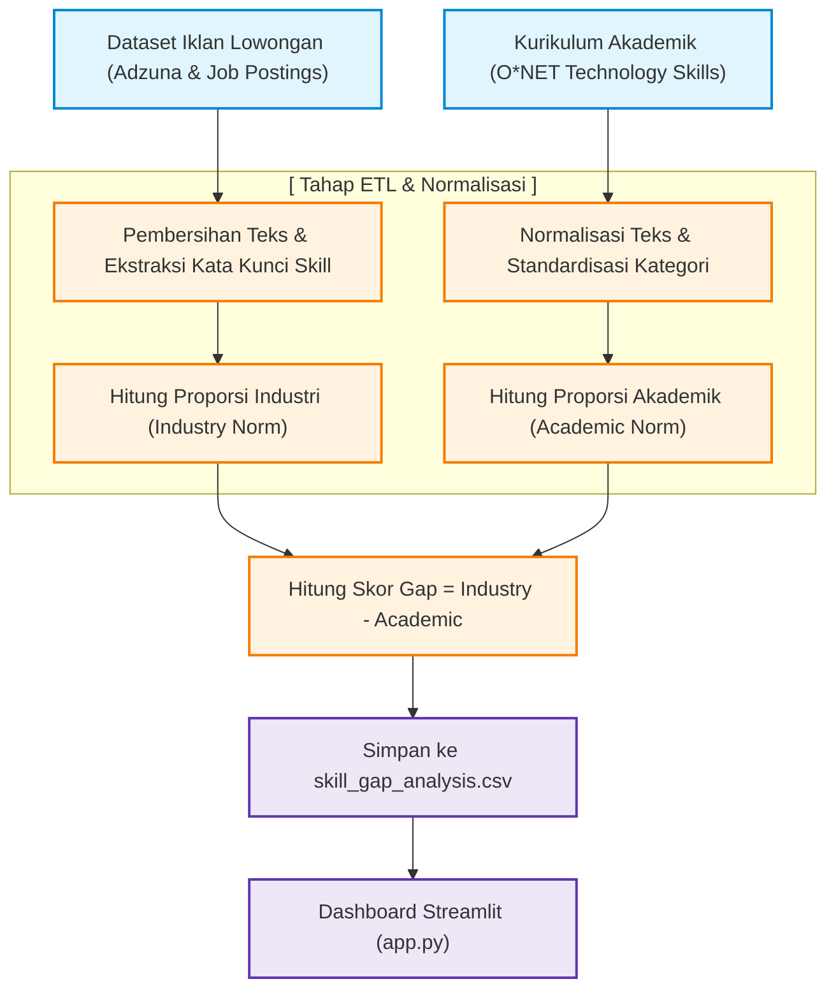

# Panduan Sederhana: Proses Pengembangan Analisis Skill Gap
**Proyek: Analisis Kesenjangan Keterampilan (Skill Gap)**  
*Mata Kuliah / Tim Projek: Semester 4 Politeknik Negeri Madiun*

Buku panduan ini menjelaskan secara sederhana bagaimana data diolah dari sumber mentah (iklan lowongan pekerjaan dan kurikulum standard akademik) hingga menghasilkan analisis kesenjangan (*Skill Gap*) yang ditampilkan di dashboard. Panduan ini dirancang khusus agar Anda mudah memahaminya dan lancar ketika mempresentasikannya di depan Dosen Penguji.

---

## 1. Alur Pemrosesan Data (ETL Pipeline)

Berikut adalah diagram alur bagaimana data mengalir dari sumber mentah hingga masuk ke dashboard:

### Penjelasan Alur:
1. **Porsi Industri (Industry Norm)**: Mengukur seberapa sering sebuah skill muncul di iklan lowongan kerja dibagi dengan total seluruh kemunculan skill di industri.
2. **Porsi Akademik (Academic Norm)**: Mengukur seberapa sering sebuah skill diajarkan dalam standar kurikulum O*NET dibagi dengan total seluruh kemunculan skill di akademik.
3. **Pencarian Gap (Kesenjangan)**: Selisih antara kebutuhan industri dengan kesediaan kurikulum akademik dihitung menggunakan rumus.

---

## 2. Formula Penghitungan Skill Gap

Formula matematis sederhana yang kami gunakan untuk menilai tingkat kesenjangan adalah:

$$\text{Skill Gap Score} = \text{Industry Norm} - \text{Academic Norm}$$

### Logika Hasil Skor:
* **Skor Positif (+)**: Kebutuhan Industri **lebih besar** daripada Kurikulum Akademik. Ini berarti skill tersebut sangat dicari oleh perusahaan tetapi **kurang diajarkan** di perkuliahan.
* **Skor Negatif (-)**: Kurikulum Akademik **lebih besar** daripada Kebutuhan Industri. Ini berarti skill tersebut sangat banyak diajarkan, namun permintaannya di pasar kerja relatif lebih kecil.

---

## 3. Panduan Menjawab Pertanyaan Dosen Penguji

Berikut beberapa bocoran pertanyaan yang sering diajukan dosen beserta cara menjawabnya secara cerdas:

* **Tanya: Mengapa data industri dan akademik perlu dinormalisasi sebelum dikurangkan?**
  * **Jawab:** *"Karena jumlah total data di industri (puluhan ribu baris iklan lowongan) jauh lebih banyak daripada data kurikulum akademik (ratusan baris standar O*NET). Jika kami langsung mengurangkan frekuensi aslinya, maka hasil pengurangannya tidak akan adil. Oleh karena itu, kami mengubah frekuensi menjadi skala proporsi (0 sampai 1) agar perbandingannya adil (apel-ke-apel)."*

* **Tanya: Apa guna pembagian kategori Hard Skill dan Soft Skill di dashboard?**
  * **Jawab:** *"Pembagian ini membantu pengambil kebijakan kurikulum. Kesenjangan pada Hard Skill (seperti Python atau SQL) biasanya diselesaikan dengan menambahkan materi praktikum, sedangkan kesenjangan pada Soft Skill (seperti Komunikasi atau Kepemimpinan) diselesaikan dengan metode pembelajaran berbasis proyek kelompok (Project-Based Learning)."*

* **Tanya: Apa saran rekomendasi konkret dari hasil analisis dashboard ini?**
  * **Jawab:** *"Untuk skill-skill dengan Skor Gap positif tertinggi (seperti Python atau SQL), kampus disarankan untuk mendesain ulang kurikulum dengan menambah porsi mata kuliah praktikum database dan pemrograman, atau mengadakan bootcamp khusus sertifikasi agar lulusan siap kerja."*
