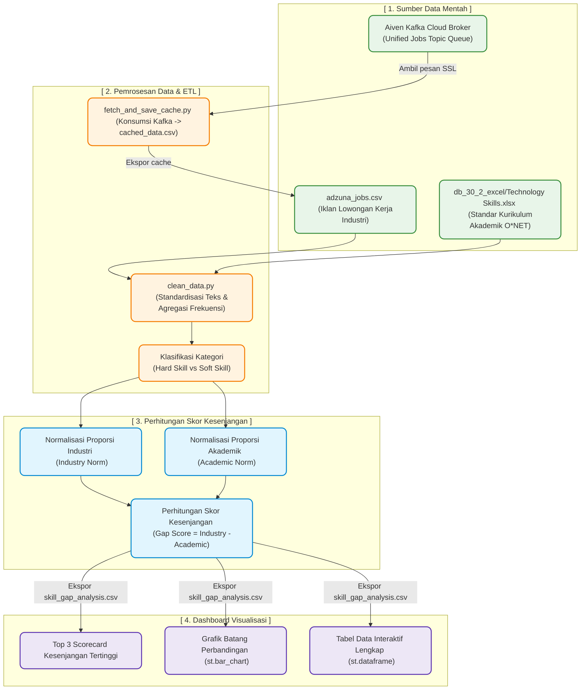

# 📖 Panduan Proses Pengembangan Analisis Kesenjangan Keahlian (Skill Gap)
**Proyek: Analisis Kesenjangan Keterampilan (Skill Gap)**  
*Mata Kuliah / Tim Projek: Semester 4 Politeknik Negeri Madiun (S4 Data Engineering)*

Panduan ini berisi penjelasan lengkap dan terstruktur mengenai alur pemrosesan data (ETL), pembersihan data, logika penghitungan kesenjangan, dan implementasi visualisasinya di dashboard Streamlit. Dokumen ini dirancang agar mudah dibaca dan dapat menjadi bahan rujukan utama saat menghadapi presentasi sidang Tim Projek di hadapan Dosen Penguji.

---

## 1. Alur Pemrosesan Data (ETL & Analysis Pipeline)

Diagram di bawah ini menggambarkan perjalanan data dari file mentah di lokal dan broker cloud (Aiven Kafka) hingga menjadi dataset kesenjangan siap saji di dashboard:

### Penjelasan Rinci Alur Kerja ETL:
1. **Fase 1 (Sumber Data):** Kita memiliki data industri berupa berkas CSV berisi ribuan iklan lowongan kerja (`adzuna_jobs.csv`) dan data akademik berupa berkas Excel standar keahlian O*NET (`Technology Skills.xlsx`). Selain itu, ada antrean pesan dinamis di broker cloud Aiven Kafka.
2. **Fase 2 (ETL & Caching):**
   * Script `fetch_and_save_cache.py` terhubung secara aman (SSL) ke broker Aiven Kafka, menarik seluruh pesan hingga offset terakhir, dan menyimpannya sebagai berkas CSV lokal (`cached_data.csv`) untuk mempercepat proses loading data.
   * Script `clean_data.py` menyaring dan membersihkan nama-nama skill menggunakan ekspresi reguler (Regex) agar ejaan singkatan teknologi standar seragam (contoh: "js" disatukan menjadi "javascript", "ml" menjadi "machine learning").
   * Skill-skill diklasifikasikan ke dalam kategori **Hard Skill** atau **Soft Skill** menggunakan pencocokan kata kunci dasar.
3. **Fase 3 (Normalisasi & Kalkulasi):** Data industri dan akademik memiliki jumlah baris yang berbeda jauh (data industri puluhan ribu, data akademik hanya ratusan). Jika frekuensi mentah langsung dibandingkan, nilainya tidak akan adil. Oleh karena itu, kita membagi frekuensi kemunculan tiap skill dengan total frekuensi di masing-masing dataset untuk mendapatkan nilai proporsi normalisasi (**Industry Norm** dan **Academic Norm**).
4. **Fase 4 (Visualisasi):** Hasil skor gap disimpan ke dalam berkas `skill_gap_analysis.csv` dan dibaca oleh `app.py` untuk merender antarmuka dashboard secara interaktif.

---

## 2. Struktur Berkas yang Terlibat

Untuk membangun sistem analisis gap ini, berkas-berkas berikut ini wajib dibuat dan dikonfigurasi:

* **`fetch_and_save_cache.py`** (Python Script): Mengambil pesan pekerjaan dari cloud Aiven Kafka broker secara berkala menggunakan library `kafka-python` dengan autentikasi SSL (CA, Service Certificate, Service Key) dan menyimpannya sebagai berkas CSV lokal.
* **`clean_data.py`** (Python Script): Melakukan pembersihan teks (*text cleaning*), pemetaan taksonomi keahlian, penghitungan total frekuensi kemunculan skill di industri vs akademik, perhitungan rumus kesenjangan, dan menyimpan hasil akhirnya sebagai berkas `skill_gap_analysis.csv`.
* **`app.py`** (Python Script): Dashboard Streamlit yang memuat data `skill_gap_analysis.csv`, menyaring data berdasarkan input sidebar kategori (Hard/Soft Skill), menampilkan peringkat kesenjangan tertinggi, dan memvisualisasikan data menggunakan `st.bar_chart` kelompok.
* **`skill_gap_analysis.csv`** (Dataset CSV): File data tabular hasil olahan ETL yang menyimpan kolom `nama_skill`, `kategori`, `industry_norm`, `academic_norm`, dan `skill_gap_score`.

---

## 3. Rumus Matematis Analisis Kesenjangan (Skill Gap)

Rumus yang digunakan untuk mencari tingkat kesenjangan kompetensi adalah:

$$\text{Skill Gap Score} = \text{Industry Norm} - \text{Academic Norm}$$

Di mana nilai proporsi dihitung dengan:

$$\text{Industry Norm} = \frac{\text{Frekuensi Skill } i \text{ di Lowongan Kerja}}{\sum (\text{Total Frekuensi Seluruh Skill di Lowongan})}$$

$$\text{Academic Norm} = \frac{\text{Frekuensi Skill } i \text{ di Kurikulum O*NET}}{\sum (\text{Total Frekuensi Seluruh Skill di Kurikulum})}$$

### Cara Membaca Skor Akhir:
* **Skor Gap Bernilai Positif (+):** Menunjukkan kesenjangan tinggi. Keahlian tersebut banyak dicari oleh perusahaan di industri, namun jarang atau belum diajarkan di institusi akademik (*under-represented*). Keahlian ini adalah prioritas utama untuk segera ditambahkan ke modul ajar kampus.
* **Skor Gap Bernilai Negatif (-):** Menunjukkan kelebihan pasokan keahlian (*over-represented*). Keahlian tersebut sangat sering diajarkan di perkuliahan, namun kebutuhan riil di iklan lowongan pekerjaan industri relatif kecil.

---

## 4. Panduan Menjawab Pertanyaan Dosen Penguji

* **Tanya: Mengapa kita harus menggunakan nilai proporsi (normalisasi), bukan membandingkan angka frekuensi aslinya?**
  * **Jawab:** *"Jumlah data iklan lowongan kerja di industri sangat besar (mencapai puluhan ribu data), sedangkan data standar kurikulum akademik di O*NET sangat terbatas (hanya ratusan data). Jika kita membandingkan frekuensi aslinya secara langsung, data industri akan mendominasi secara mutlak dan perbandingannya menjadi tidak adil. Normalisasi ke bentuk proporsi (skala 0 sampai 1) membuat perbandingan bersifat 'apel-ke-apel' (apple-to-apple), sehingga hasil kesenjangan yang diperoleh valid secara statistik."*
* **Tanya: Bagaimana cara memilah kategori Hard Skill dan Soft Skill di program Anda?**
  * **Jawab:** *"Pada file `clean_data.py`, kami membuat daftar kata kunci referensi soft skill (seperti komunikasi, kepemimpinan, kerja sama, manajemen). Jika nama keahlian mengandung salah satu kata kunci tersebut, sistem akan mengelompokkannya sebagai Soft Skill. Sisanya secara otomatis akan dikategorikan sebagai Hard Skill."*
* **Tanya: Apa rekomendasi nyata bagi instansi akademik dari hasil dashboard Anda?**
  * **Jawab:** *"Untuk kompetensi keahlian yang memiliki Skor Gap positif terbesar (seperti pemrograman Python, SQL, Git, Apache Spark), kampus disarankan untuk mendesain ulang kurikulum perkuliahan dengan memperbanyak sesi praktikum laboratorium, mengadakan workshop sertifikasi industri, atau menyesuaikan mata kuliah pilihan agar lulusan lebih siap menghadapi tuntutan dunia kerja."*
