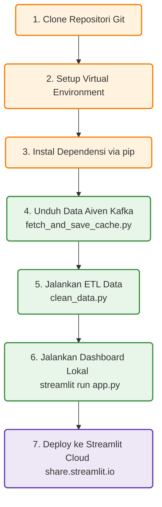

# 📦 Panduan Lengkap: Tutorial Deployment Gap Analysis Dashboard
**Modul: Analisis Kesenjangan Keahlian (Industri vs Akademik)**  
*Mata Kuliah / Tim Projek: Semester 4 Politeknik Negeri Madiun (S4 Data Engineering)*

Panduan ini berisi petunjuk lengkap langkah demi langkah dari awal untuk memasang, menyiapkan data, menjalankan dashboard analisis kesenjangan di komputer lokal Anda, hingga melakukan deployment online secara gratis ke Streamlit Community Cloud.

---

## 1. Diagram Alur Pemasangan & Deployment

Diagram di bawah ini menggambarkan alur kerja yang harus diikuti untuk menjalankan dashboard Gap Analysis dari awal:



---

## 2. Struktur Direktori Berkas Modul

Sebelum memulai, pastikan berkas-berkas berikut ini berada di dalam folder proyek Anda:

```
Gap Analysis/
├── .streamlit/
│   └── config.toml             # Konfigurasi Streamlit (Nonaktifkan fileWatcherType)
├── ssl/
│   ├── ca.pem                  # Sertifikat CA untuk Aiven Kafka SSL (Opsional untuk fetch)
│   ├── service.cert            # Sertifikat client untuk Aiven Kafka SSL (Opsional untuk fetch)
│   └── service.key             # Kunci privat client untuk Aiven Kafka SSL (Opsional untuk fetch)
├── db_30_2_excel/
│   ├── Technology Skills.xlsx  # Data kurikulum teknologi akademik O*NET
│   └── Skills.xlsx             # Data keahlian umum akademik O*NET
├── app.py                      # File program utama dashboard Streamlit
├── clean_data.py               # File program ETL pembersihan data & hitung gap
├── fetch_and_save_cache.py     # File program untuk mengonsumsi data dari Aiven Kafka
├── skill_gap_analysis.csv      # Berkas data hasil olahan (ETL) yang siap divisualisasikan
├── cached_data.csv             # Berkas data mentah lowongan hasil unduh Kafka
├── adzuna_jobs.csv             # Berkas dataset iklan lowongan kerja industri
└── TUTORIAL_DEPLOYMENT.md      # Berkas panduan ini (yang sedang Anda baca)
```

---

## 3. Pemasangan & Eksekusi di Komputer Lokal (Local Run)

Ikuti langkah-langkah di bawah ini secara runtut untuk menyalakan dashboard di komputer Anda:

### Langkah 3.1: Masuk ke Folder Proyek
Buka Command Prompt (CMD), PowerShell, atau Terminal di sistem operasi Anda, lalu masuk ke folder modul:
```bash
cd "Analisis-Kesenjangan-Keterampilan/Gap Analysis"
```

### Langkah 3.2: Konfigurasi Virtual Environment (venv)
Membuat lingkungan python terisolasi untuk menghindari bentrok pustaka.
```bash
# Membuat virtual environment baru
python -m venv venv

# Mengaktifkan di Windows (PowerShell)
.\venv\Scripts\Activate.ps1

# Mengaktifkan di Windows (CMD)
.\venv\Scripts\activate

# Mengaktifkan di Linux atau MacOS
source venv/bin/activate
```

### Langkah 3.3: Instalasi Library Utama
Dashboard Gap Analysis ini sangat ringan karena hanya memerlukan library **Streamlit**, **Pandas**, **openpyxl** (untuk membaca Excel), dan **kafka-python** (jika ingin mengambil data dari Aiven Kafka):
```bash
pip install streamlit pandas openpyxl kafka-python
```

### Langkah 3.4: Pengambilan Data & Penyiapan Cache (Opsional)
Jika berkas `cached_data.csv` belum terbentuk atau ingin diperbarui dengan data paling baru dari antrean Kafka di cloud Aiven:
1. Pastikan berkas sertifikat aman (`ca.pem`, `service.cert`, `service.key`) sudah diletakkan di dalam folder `ssl/`.
2. Jalankan skrip penarik data:
   ```bash
   python fetch_and_save_cache.py
   ```
   *Skrip ini akan terhubung ke cloud Aiven Kafka, menarik seluruh antrean pesan lowongan kerja, dan mengekspornya ke dalam berkas `cached_data.csv`.*

### Langkah 3.5: Eksekusi Pipa ETL (`clean_data.py`)
Jalankan skrip ETL untuk membersihkan data, menyatukan dataset industri-akademik, mengklasifikasi kategori skill, dan menghitung skor gap kesenjangan:
```bash
python clean_data.py
```
*Hasil dari eksekusi ini akan memperbarui berkas `skill_gap_analysis.csv`.*

### Langkah 3.6: Menjalankan Dashboard Streamlit
```bash
streamlit run app.py
```
Aplikasi web secara otomatis akan terbuka di browser Anda pada alamat: `http://localhost:8501`.

---

## 4. Deployment ke Streamlit Community Cloud (Online & Gratis)

Karena dashboard ini dirancang mandiri menggunakan database hasil pra-pemrosesan (`skill_gap_analysis.csv`), proses deployment ke internet menjadi sangat mudah dan gratis:

1. Unggah (push) seluruh perubahan kode dan berkas CSV Anda ke repositori **GitHub** Anda.
2. Buka dan masuk ke **[share.streamlit.io](https://share.streamlit.io)** menggunakan akun GitHub Anda.
3. Klik tombol **New App** di sudut kanan atas dashboard Streamlit Cloud.
4. Isi data konfigurasi deployment aplikasi sebagai berikut:
   * **Repository:** `Irham-Najib-Azimul-Qowi/Analisis-Kesenjangan-Keterampilan`
   * **Branch:** `main`
   * **Main file path:** `Gap Analysis/app.py`
5. Klik tombol **Deploy!**
6. Server Streamlit Cloud akan menyusun kontainer aplikasi Anda dan memasang library secara otomatis. Dalam waktu 1-2 menit, dashboard Anda sudah online secara global (contoh: `https://gap-analysis.streamlit.app`).

*Catatan: Modul Gap Analysis ini membaca data dari file CSV lokal hasil pemrosesan ETL, sehingga Anda tidak perlu mengkonfigurasi Secrets atau variabel lingkungan apa pun di panel pengaturan advanced Streamlit Cloud.*
